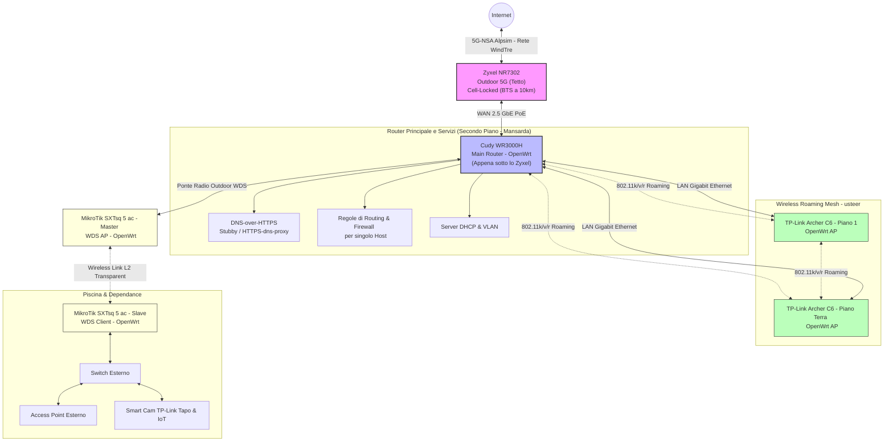

# DIY-FWA-Infrastructure: FWA 5G-NSA Casalinga con Roaming Mesh OpenWrt e Link Point-to-Point

Benvenuti in questo repository di portfolio in cui documento la progettazione, la realizzazione e l'ottimizzazione di un'infrastruttura di rete **Fixed Wireless Access (FWA) casalinga avanzata**. 

Questo progetto nasce da una necessità reale: l'assenza di connettività broadband cablata (FTTC/FTTH) in una casa disposta su tre piani e la scarsa qualità delle offerte FWA commerciali (limitate a 30 Mbps e soggette a pesanti limitazioni di traffico). La soluzione finale è un'architettura di rete customizata in grado di erogare **300 Mbps in download e 50 Mbps in upload** (nonostante la BTS si trovi a circa **10 km di distanza** in linea d'aria), gestita interamente tramite hardware flashato con **OpenWrt**, roaming wireless ottimizzato e ponti radio a corto raggio.

---

## 🛠️ Tecnologie e Competenze Dimostrate

* **Embedded Operating Systems:** Flashing, configurazione e hardening di router commerciali tramite **OpenWrt** (sysupgrade, firmware recovery, tftp).
* **Reverse Engineering & Shell Access:** Analisi delle vulnerabilità di configurazione su modem Zyxel per ottenere accesso root/SSH locale bypassando i blocchi operatore.
* **Network & Wireless Engineering:** Progettazione di reti wireless multi-AP, configurazione dello standard **802.11k/v/r** (Fast Transition) e sintonia fine delle soglie di roaming client tramite **Usteer**.
* **Ponti Radio Point-to-Point (P2P):** Creazione di collegamenti wireless a corto raggio in modalità **WDS (Wireless Distribution System)** per estendere in modo trasparente (L2 bridge) la LAN all'esterno (piscina e dependance).
* **Network Security & Privacy:** Implementazione di **DNS-over-HTTPS (DoH)**, isolamento dei client tramite regole di firewalling avanzate su OpenWrt e gestione selettiva del traffico per singolo host.
* **Scripting Bash & Automation:** Sviluppo di script di monitoraggio e ripristino per modem e interfacce tramite **ModemManager** e comandi AT.

---

## 📐 Architettura di Rete Attuale (Fase Finale)

Il diagramma seguente mostra il flusso della connettività, dal modem 5G esterno fino ai dispositivi terminali e alle estensioni outdoor:

---

## 📈 L'Evoluzione dell'Infrastruttura

La costruzione di questa rete ha richiesto circa due anni di iterazioni tecnologiche e superamento di limitazioni hardware/software.

### Fase 1: Il Setup Iniziale 4G & Limiti di Giga
* **Necessità:** Connessioni FTTC/FTTH assenti. FWAs commerciali limitate a 30/3 Mbps con cap rigidi.
* **Soluzione base:** Router da interno **TP-Link Archer MR600** (LTE Cat6), abbinato a un'antenna esterna a pannello orientata verso la BTS. SIM dati **PosteMobile Casa Web** (su rete Vodafone).
* **Colli di bottiglia:** 
  1. *Limitazioni del Provider:* Inizialmente illimitata, la SIM PosteMobile ha introdotto limiti stringenti (cap a circa 600 GB/mese), incompatibili con un consumo familiare reale di **1 - 1.5 TB/mese**.
  2. *Prestazioni:* Il modem Cat6 non permetteva l'aggregazione di bande superiori, limitando la velocità a circa 50-80 Mbps in download nei momenti migliori.

### Fase 2: Zyxel LTE5398-M904, Root Exploit e il Flashing di OpenWrt
* **Miglioramento hardware:** Acquisto di uno **Zyxel LTE5398-M904** (LTE Cat18, MIMO 4x4), in grado di aggregare fino a 5 bande LTE.
* **Le problematiche riscontrate:** Nonostante le ottime velocità (150-200 Mbps), il firmware stock mostrava gravi problemi di stabilità. Al cambio IP programmato o a variazioni di cella della BTS, il modem andava in blocco e impiegava diversi minuti per ristabilire la connessione internet.
* **La svolta tecnica (Root & OpenWrt):** 
  1. *L'exploit:* La password di root generata di default non era più calcolabile con i tool online a causa di aggiornamenti firmware. Sfruttando un bug di controllo degli accessi del servizio FTP (accesso in scrittura su `zcfg_config.json` come `admin`) e un attacco con oracolo di decrittazione tramite il modulo Dynamic DNS (DDNS), sono riuscito a ricavare la password di root in chiaro (documentato nel forum ufficiale di OpenWrt come utente `manu99it`).
  2. *Flashing:* Installazione di OpenWrt sul modem e utilizzo di **ModemManager** in sostituzione dello stack proprietario.
  3. *Gestione Riconnessione:* Configurazione dello script proposto dall'utente Lynx sul forum OpenWrt, posizionato nella directory degli hooks di ModemManager (`/usr/lib/ModemManager/connection.d/`). Ad oggi, una variante di questo script è stata inserita ufficialmente nel branch master di ModemManager. All'evento di disconnessione della sessione LTE, lo script notifica immediatamente il demone `netifd` di OpenWrt e forza un `ifup` istantaneo, riducendo i tempi di downtime da minuti a pochissimi secondi.
  * *Approfondimento:* [Vedi il Write-up dell'Exploit di Root dello Zyxel](docs/root_exploit_zyxel.md).

### Fase 3: Copertura Multi-piano con Wireless Roaming e Usteer
* **Problema:** Casa su tre piani con pareti spesse in cemento armato che bloccavano i segnali ad alta frequenza.
* **Soluzione:** Flashing di **OpenWrt** su due vecchi router **TP-Link Archer C6** e posizionamento strategico sui piani.
* **Implementazione Roaming:** Configurazione dei parametri **802.11k/802.11v** e del Fast Transition **802.11r** su tutti gli Access Point (incluso il router principale).
* **Ottimizzazione (Usteer):** Per prevenire il fenomeno dei "client appiccicosi" (dispositivi che rimangono connessi ad AP lontani con segnale degradato), ho implementato il demone **Usteer**. Questo monitora il segnale dei client (RSSI) e ne forza la disconnessione o il re-indirizzamento verso l'AP più vicino.
  * *Approfondimento:* [Vedi la guida tecnica sul Roaming & Usteer](docs/roaming_mesh_usteer.md).

### Fase 4: La Transizione al 5G-NSA e il Link Point-to-Point
* **Upgrade al 5G:** Sostituzione della SIM con **Alpsim** (rete WindTre Business), con dati realmente illimitati e senza la disconnessione forzata dell'IP ogni 4 ore.
* **Hardware Esterno:** Acquisto di un modem esterno **Zyxel NR7302 5G-NSA/SA**, posizionato sul tetto. Tramite l'interfaccia proprietaria, ho eseguito il **cell-locking** sulla BTS WindTre meno satura e con miglior rapporto segnale/rumore (SINR).
* **Router di Confine:** Posizionamento in cascata di un router **Cudy WR3000H** (installato al secondo piano/mansarda, appena sotto lo Zyxel montato sul tetto, con porta WAN da **2.5 GbE** per non creare colli di bottiglia con il 5G) su cui è stato installato OpenWrt.
* **Estensione Outdoor (Link P2P):** Per portare la connettività alla piscina e alla depandance adiacente senza scavare trincee per i cavi, ho configurato un ponte radio wireless Point-to-Point in modalità WDS (Wireless Distribution System) trasparente a Layer 2 su frequenza 5GHz. Ho utilizzato due antenne **MikroTik SXTsq 5 ac** su cui ho installato OpenWrt (aggirando così i vincoli della licenza RouterOS Level 3). Questo garantisce continuità di subnet e latenze inferiori a 2ms.
  * *Approfondimento:* [Vedi i dettagli del Link Point-to-Point](docs/link_p2p_pool.md).

---

## 🔒 Sicurezza, Privacy e Controllo del Traffico

Gestire l'intera infrastruttura di rete con OpenWrt ha abilitato funzioni di livello Enterprise:

1. **DNS-over-HTTPS (DoH):** Configurato `https-dns-proxy` per crittografare tutte le query DNS dirette all'esterno verso server DNS sicuri (Cloudflare/Quad9), prevenendo il tracciamento e il DNS hijacking del provider cellulare.
2. **Policy Routing e Regole Custom:** 
   * Instradamento prioritario per dispositivi di smart working (latenza minima e QoS dedicato).
   * Restrizioni e regole firewall per i dispositivi IoT domestici (impossibilitati a comunicare con l'esterno se non strettamente necessario).
   * Isolamento e VLAN per la rete ospiti (Guest Network).

---

## 📂 Struttura della Repository

* [`/docs/root_exploit_zyxel.md`](docs/root_exploit_zyxel.md): Analisi dell'exploit XML e shell root sul modem LTE5398-M904.
* [`/docs/roaming_mesh_usteer.md`](docs/roaming_mesh_usteer.md): Configurazione teorica e pratica del roaming 802.11k/v/r e di usteer.
* [`/docs/link_p2p_pool.md`](docs/link_p2p_pool.md): Dettagli tecnici della realizzazione del link Point-to-Point.
* [`/scripts/10-report-down-and-reconnect`](scripts/10-report-down-and-reconnect): Script hook per intercettare le disconnessioni di ModemManager e forzare la riconnessione rapida.
* [`/configs/`](configs/): File di configurazione reali di OpenWrt per `usteer`, parametri `wireless` (roaming) e `DoH`.
